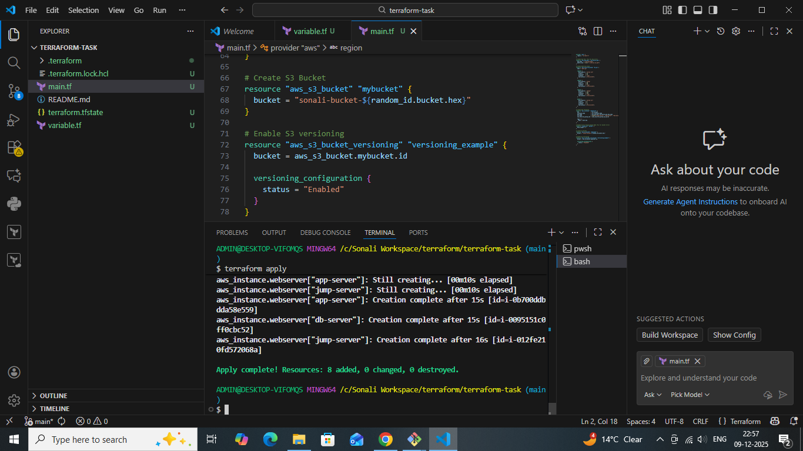
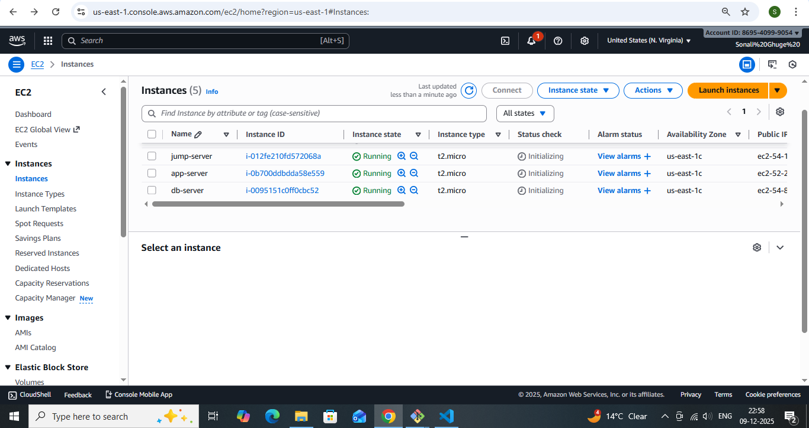

# Terraform-Task -AWS Environment Setup
## Overview
This project demonstrates setting up a small AWS environment using Terraform. The following resources are deployed:

### 3 EC2 instances:
- jump-server
- app-server
- db-server
### 1 Security Group allowing:
- SSH (22)
- HTTP (80)
- HTTPS (443)

1 S3 bucket with versioning enabled, used as Terraform remote backend

All resources are deployed in the default VPC.

### Terraform Files
- main.tf : EC2 instances, Security Group, S3 bucket resources
- variables.tf : Variables for AMI ID, instance type, tags, bucket name
- README.md : Documentation and screenshots
## Screenshots
- Terraform apply 

- AWS Management Console

## Usage Instructions
1.  Clone the repository: https://github.com/iamSonaliGhuge/terraform-task.git

2. cd terraform-task

3. Initialize Terraform:

terraform init

4. Review the plan:

5. terraform plan

6. Apply the Terraform configuration:

terraform apply --auto-approve

7. Access EC2 instances using the public IPs shown in outputs.
## Conclusion
- Terraform makes it easy to provision AWS resources consistently and quickly

- The setup is modular and can be extended for larger environments.

- All outputs, including public IPs and bucket name, are clearly captured for reference.